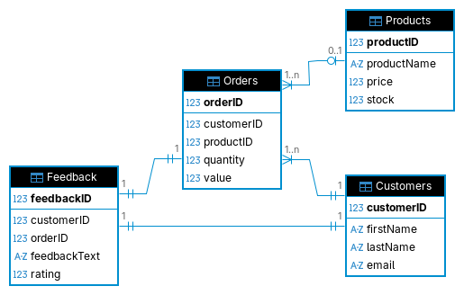

# SQL Final Projects: SQLite CRM

This repository contains a practical SQLite customer relationship management
(CRM) project built with Python's standard-library `sqlite3` module. It
includes a relational schema, seed database, CRUD operations, reporting
queries, and an interactive terminal menu.

## Why this project is useful

The project is a compact example of connecting a Python application to a
relational database and modeling common CRM workflows:

- Manage customers, products, orders, and feedback.
- Perform create, read, update, and delete operations for each entity.
- Calculate order values from product prices and requested quantities.
- Decrease tracked product stock when an order is created.
- Generate customer spending, product sales, and feedback analytics reports.
- Explore the schema with the included entity-relationship diagram.
- Use the standalone SQL and database files to inspect or query the data
  directly.

## Project files

| File | Purpose |
| --- | --- |
| [`main.py`](main.py) | Python CRUD functions, reports, and interactive CLI |
| [`final_project.db`](final_project.db) | SQLite database used by `main.py` |
| [`final_project.sql`](final_project.sql) | Schema and indexes for the CRM database |
| [`final_project.md`](final_project.md) | Project design notes and implementation walkthrough |
| [`final_project_erd.png`](final_project_erd.png) | CRM entity-relationship diagram |
| [`customer_feedback.db`](customer_feedback.db) | Earlier customer feedback and sales exercise database |
| [`customer_feedback.sql`](customer_feedback.sql) | SQL export for the earlier exercise |
| [`tasks.md`](tasks.md) | Earlier SQL exercise notes |

## Getting started

### Prerequisites

- Python 3.8 or newer
- SQLite 3 (included with Python and not required as a separate dependency)

The application uses only Python's standard library, so no package
installation or virtual environment is required.

### Run the interactive CRM

From the repository root, run:

```bash
python3 main.py
```

The program opens `final_project.db` in the current working directory and
displays a menu for managing records and running reports:

```text
CRM MENU
1. Create customer
...
17. Customer orders report
18. Product sales report
19. Feedback analytics report
0. Exit
```

For example, choose `5` to add a product, choose `1` to add a customer, and
choose `9` to create an order. Order value is calculated automatically from
the selected product price; available stock is checked and reduced when
appropriate.

### Use the database directly

The schema can be recreated in another SQLite database with:

```bash
sqlite3 /tmp/crm.db < final_project.sql
```

You can then inspect the tables or run ad-hoc reports:

```bash
sqlite3 /tmp/crm.db
```

```sql
.tables
SELECT productName, price, stock FROM Products;
SELECT customerID, firstName, lastName, email FROM Customers;
```

The Python module exposes functions such as `create_customer`,
`get_all_products`, `create_order`, `report_customer_orders`,
`report_product_sales`, and `report_feedback_analytics` for programmatic use.
Importing `main.py` opens the configured database connection, so applications
should call [`close_connection`](main.py) when finished.

## Database model

The final project database contains:

- `Customers`: customer names and unique email addresses.
- `Products`: product names, prices, and optional stock counts.
- `Orders`: customer purchases, quantities, and calculated values.
- `Feedback`: one feedback record per customer and order, with a rating from
  1 to 5.

Foreign keys connect orders and feedback to their related records. The
included indexes support common product, quantity, and order relationship
lookups.



## Help and documentation

Start with the [implementation notes](final_project.md) for the design
decisions, schema, CRUD approach, stock handling, and report query examples.
For questions or reproducible problems, [open an issue in the GitHub
repository](https://github.com/VoidLance/course-files-sql-final-projects/issues)
with the command used, expected behavior, actual behavior, and relevant
SQLite/Python versions.

## Maintainers and contributing

This project is maintained by [VoidLance](https://github.com/VoidLance).
Contributions are welcome:

1. Open an issue to describe a bug, question, or proposed improvement.
2. Create a focused branch and make the smallest related change.
3. Verify the Python CLI and any affected SQL locally.
4. Submit a pull request describing the change and how it was tested.

Please keep schema changes, SQL examples, and Python behavior documented
together so the repository remains easy to follow for learners and
contributors.

## License

No `LICENSE` file is currently included in this repository. Add or reference
the project license before distributing the code outside its intended
educational context.
